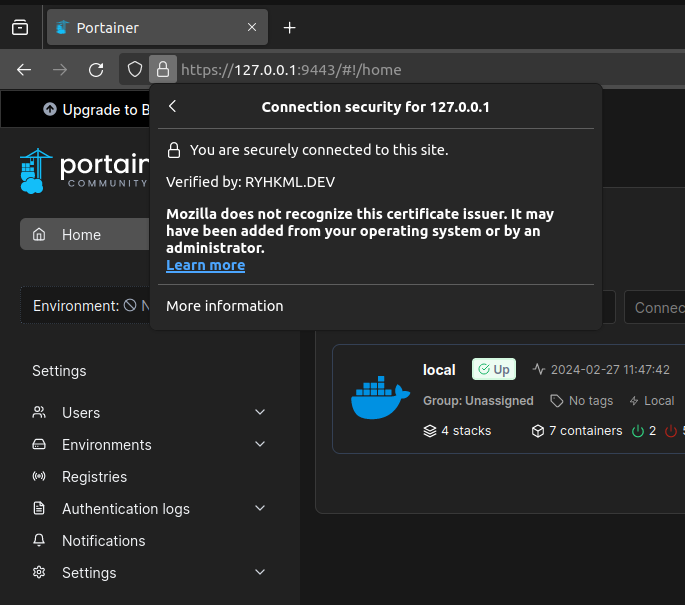

## Why ECDSA
[RSA](https://en.wikipedia.org/wiki/RSA_(cryptosystem)) and [ECDSA](https://en.wikipedia.org/wiki/Elliptic_Curve_Digital_Signature_Algorithm) are both public-key cryptography algorithms that are used for digital signatures and encryption. They are both very secure, but they have different strengths and weaknesses. RSA is the older and more widely supported algorithm. It is based on the difficulty of factoring large numbers. RSA keys are relatively large, which can make them slow to use. ECDSA is a newer algorithm that is based on elliptic curve cryptography. It is just as secure as RSA, but it uses much smaller keys, which makes it faster. ECDSA is not as widely supported as RSA, but it is becoming more popular.

### Download script

```bash
curl -s -o self-signed-ssl https://raw.githubusercontent.com/ryhkml/self-signed-ssl/main/openssl
chmod +x ./self-signed-ssl
```

### Run script

```bash
./self-signed-ssl
```

Output directory `./tls/<CN>`

### Sample Portainer HTTPS

