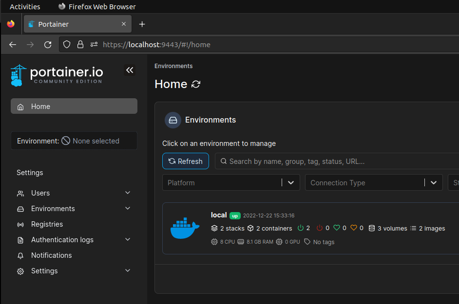
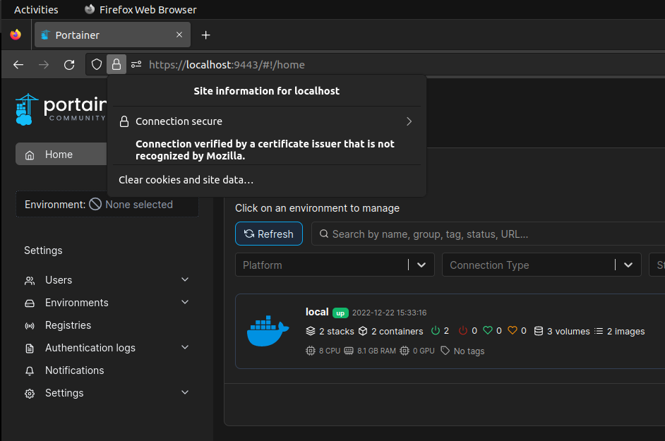

## Sertifikat Gratis Protokol HTTPS
https://www.openssl.org

### Cara Penggunaan
  1. `./run.sh <DOMAIN> <DAYS>`
  2. `sudo cp ./<DOMAIN>/ca.pem /usr/local/share/ca-certificates/ca.crt`
  3. `sudo update-ca-certificates`
  4. `masukkan sertifikat ke dalam browser`

### Menghapus .crt (jika dibutuhkan)
  1. `sudo rm -rf /usr/local/share/ca-certificates/ca.crt`
  2. `sudo update-ca-certificates --fresh`

### Bukti Nyata Protainer HTTPS

