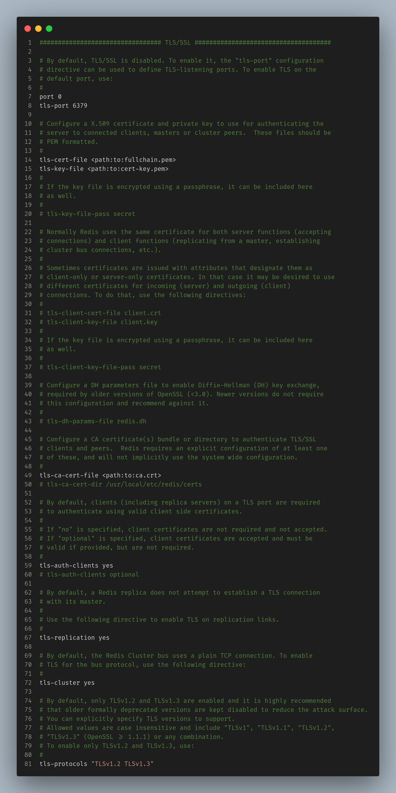

## Buat Sertifikat Gratis
Sumber https://www.openssl.org

### Cara Pengunaan
  1. `wget https://raw.githubusercontent.com/ryhkml/self-signed-ssl/main/run.sh -O run.sh`
  2. `chmod +x run.sh`
  3. `./run.sh <HOSTNAME/DOMAIN> <DURATION>`

### Validasi Sertifikat

**Browser**
  1. `sudo cp ./<HOSTNAME/DOMAIN>/ca.crt /usr/local/share/ca-certificates/ca.crt`
  2. `sudo update-ca-certificates`
  3. masukkan `ca.crt` melalui pengaturan sertifikat browser
      
**Postman**
  - masukkan `ca.crt` melalui pengaturan, kunjungi https://learning.postman.com/docs/sending-requests/certificates

**Insomnia**
  - masukkan `ca.crt` melalui pengaturan dokumen, kunjungi https://docs.insomnia.rest/insomnia/client-certificates

**curl**
  - `curl --cacert <PATH:TO:ca.crt> -X POST https://...`

### Input TLS/SSL (backend/database)
  - `ca = ca.crt`
  - `key = cert-key.pem`
  - `cert = fullchain.pem`

### Bukti Nyata Protainer HTTPS

### Contoh Redis TLS/SSL Konfigurasi

### Menghapus ca.crt (jika diperlukan)
  1. `sudo rm -rf /usr/local/share/ca-certificates/ca.crt`
  2. `sudo update-ca-certificates --fresh`